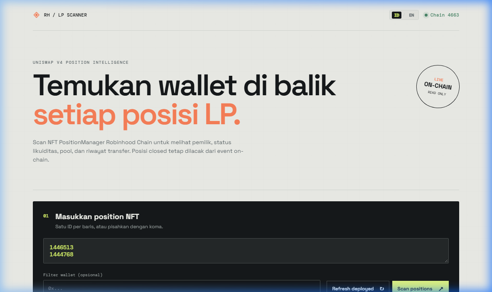
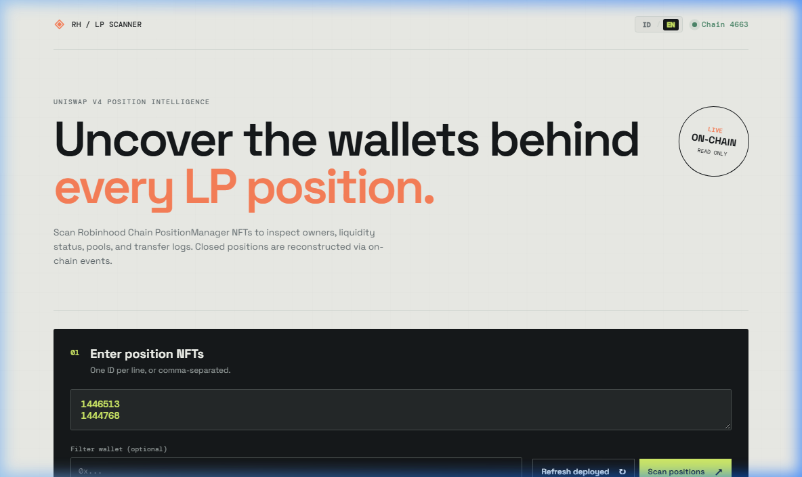
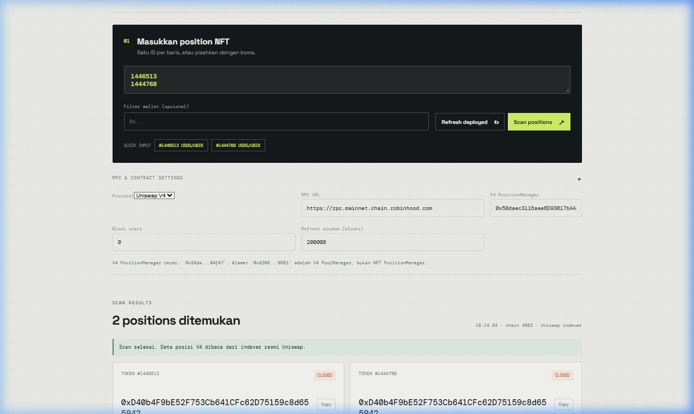

# Robinhood LP Lens

<p align="center">
  
</p>

<p align="center">
  <strong>On-Chain Position Intelligence for Robinhood Chain & Uniswap V3 / V4</strong><br>
  <em>Read-only browser scanner to track NFT liquidity positions, owner wallets, pool metadata, and transfer history.</em>
</p>

<p align="center">
  <a href="#-bahasa-indonesia">🇮🇩 Bahasa Indonesia</a> • 
  <a href="#-english">🇬🇧 English</a> • 
  <a href="#-tampilan-aplikasi--ui-preview">📸 UI Preview</a> • 
  <a href="#-petunjuk-menambahkan-gambar-di-github--github-image-guide">🖼️ Panduan Gambar GitHub</a> • 
  <a href="#-support--donations">☕ Support & Donations</a>
</p>

---

## 📸 Tampilan Aplikasi / UI Preview

| Bahasa Indonesia (`ID`) | English (`EN`) |
| :---: | :---: |
|  |  |

<p align="center">
  <em>Hasil Scan Lengkap (Full Local Launch View):</em><br>
  
</p>

---

## 🇮🇩 Bahasa Indonesia

### 📌 Ringkasan

**Robinhood LP Lens** adalah alat pelacak posisi likuiditas (LP NFT) on-chain berbasis web untuk jaringan Robinhood Chain. Aplikasi ini membaca data langsung dari blockchain melalui RPC untuk mengidentifikasi wallet pemilik posisi, status likuiditas (`OPEN` atau `CLOSED`), pasangan token, fee tier, dan jejak transfer NFT bahkan saat posisi sudah diburn atau ditutup.

Aplikasi ini sudah dilengkapi dengan **fitur bilingual (Bahasa Indonesia & English)** dengan tombol switch `ID / EN` di bar navigasi atas yang dapat dipilih secara instan.

### ✨ Fitur Utama

- **Dukungan Dwi-Bahasa (Bilingual ID / EN):** Pilihan bahasa instan langsung dari tombol header dan preferensi tersimpan di browser.
- **Deteksi Pemilik (Owner Discovery):** Menemukan current owner dari satu atau banyak NFT PositionManager secara otomatis.
- **Status Posisi Real-time:** Membaca status posisi apakah masih aktif (`OPEN`) atau sudah ditarik/diburn (`CLOSED`).
- **Data Pool Lengkap:** Menampilkan token pair (currency 0 & currency 1), liquidity, dan fee tier langsung dari smart contract.
- **Pelacakan Posisi Ditutup (Burned/Closed):** Melacak `last holder` melalui event `Transfer` jika `ownerOf` sudah tidak dapat dipanggil karena NFT telah diburn.
- **Filter Wallet Spesifik:** Memfilter hasil scan untuk wallet address tertentu.
- **Refresh Deployed (Auto-Discovery):** Memindai block terbaru untuk mendeteksi event pencetakan (*mint*) posisi baru secara otomatis tanpa perlu input manual.
- **100% Client-Side & Aman:** Membaca data langsung via RPC node tanpa menyimpan atau mengirim private key / data pengguna ke server.

---

### 🚀 Cara Menjalankan Aplikasi di Windows

#### 1. Cara Cepat (Rekomendasi)
1. Pastikan [Node.js](https://nodejs.org/) sudah terinstal di komputer Anda.
2. Klik ganda (**double-click**) file `Buka Scanner.bat`.
3. Browser akan otomatis terbuka di `http://localhost:4173`.
4. Biarkan jendela PowerShell/Command Prompt tetap terbuka selama scanner digunakan.
5. Tutup jendela PowerShell untuk menghentikan server.

#### 2. Cara Manual (Melalui Terminal)
1. Buka terminal (PowerShell atau Command Prompt) di folder proyek.
2. Jalankan perintah:
   ```powershell
   node server.js
   ```
3. Buka browser dan akses: [http://localhost:4173](http://localhost:4173)

> ⚠️ **Penting:** Jangan membuka `index.html` langsung dengan klik dua kali (file://). Server lokal `server.js` diperlukan agar browser dapat mengakses RPC dan API tanpa kendala CORS.

---

### 📖 Panduan Penggunaan Langkah demi Langkah

1. **Pilih Bahasa Tampilan:**
   - Gunakan tombol switch bahasa **`ID / EN`** di pojok kanan atas untuk mengganti bahasa aplikasi secara instan.
2. **Atur RPC & Contract Settings (Opsional):**
   - Klik tombol **`RPC & contract settings (+)`** untuk membuka panel konfigurasi.
   - Pilih protokol: **Uniswap V4** atau **Uniswap V3**.
   - Default RPC Robinhood Chain: `https://rpc.mainnet.chain.robinhood.com`
   - Default PositionManager V4: `0x58daec3116aae6D93017bAAea7749052E8a04fA7` *(Catatan: `0x8366...` adalah PoolManager, bukan PositionManager NFT)*.
3. **Masukkan Position NFT ID:**
   - Masukkan satu atau beberapa ID token NFT pada kotak teks (satu ID per baris atau pisahkan dengan koma).
   - Atau klik tombol **`QUICK INPUT`** (misal `#1446513 USDG/UBIK`) untuk pengujian instan.
4. **Filter Wallet (Opsional):**
   - Jika ingin memeriksa apakah ID tersebut milik wallet tertentu, masukkan alamat wallet (`0x...`) pada kolom **Filter wallet**.
   - Kosongkan kolom ini jika ingin menampilkan pemilik asli dari setiap NFT secara otomatis.
5. **Jalankan Scan:**
   - Klik tombol **`Scan positions ↗`**.
   - Hasil akan muncul pada kartu hasil scan dengan indikator status:
     - 🟢 **OPEN**: Posisi masih aktif dan memiliki pemilik.
     - ⚪ **CLOSED**: Posisi telah diburn/ditutup, scanner akan menampilkan pemilik terakhir (*last holder*).
6. **Gunakan Fitur "Refresh Deployed":**
   - Klik tombol **`Refresh deployed ↻`** untuk memindai transaksi mint posisi LP terbaru pada rentang block (`refreshBlocks`).
   - Token ID baru yang ditemukan akan otomatis ditambahkan ke daftar dan langsung dipindai.

---

## 🇬🇧 English

### 📌 Overview

**Robinhood LP Lens** is a read-only on-chain liquidity position (LP NFT) scanner built for Robinhood Chain. It communicates directly with blockchain RPC nodes to inspect position owners, liquidity status (`OPEN` or `CLOSED`), currency pairs, fee tiers, and historical transfer logs—even if the position NFT was previously burned or closed.

The app comes with native **bilingual support (Indonesian & English)** with an instant `ID / EN` toggle switch in the top header.

### ✨ Key Features

- **Bilingual Interface (ID / EN):** One-click language switcher in the header with persistent local preference.
- **Owner Discovery:** Identifies the current holder of single or multiple PositionManager NFTs automatically.
- **Real-Time Position Status:** Quickly reveals whether a position is active (`OPEN`) or redeemed/burned (`CLOSED`).
- **Comprehensive Pool Data:** Displays token pairs (currency 0 & currency 1), liquidity depth, and fee tiers straight from on-chain contracts.
- **Closed/Burned Tracking:** Reconstructs the last known holder via historical `Transfer` event logs when `ownerOf` reverts due to burned tokens.
- **Wallet Filter:** Allows filtering search results against a specific target address.
- **Refresh Deployed (Auto-Discovery):** Automatically scans recent blocks for newly minted position events and adds them to your inspection list.
- **100% Client-Side & Secure:** Connects directly to RPC endpoints with zero telemetry or backend storage of user data.

---

### 🚀 Running the Application on Windows

#### 1. Quick Launch (Recommended)
1. Ensure [Node.js](https://nodejs.org/) is installed on your machine.
2. Double-click **`Buka Scanner.bat`**.
3. Your default browser will launch automatically at `http://localhost:4173`.
4. Keep the terminal window open while using the scanner.
5. Close the terminal window when you wish to stop the server.

#### 2. Manual Launch (Via Terminal)
1. Open PowerShell or Command Prompt inside the project folder.
2. Start the local server:
   ```powershell
   node server.js
   ```
3. Open your browser and navigate to: [http://localhost:4173](http://localhost:4173)

> ⚠️ **Note:** Do not open `index.html` directly via double-clicking in file explorer. The local server is required to proxy and handle RPC/API requests without browser CORS restrictions.

---

### 📖 Step-by-Step User Guide

1. **Select Interface Language:**
   - Use the **`ID / EN`** switcher at the top right to swap the interface language instantly.
2. **Configure RPC & Contract Settings (Optional):**
   - Click the **`RPC & contract settings (+)`** expander.
   - Select protocol: **Uniswap V4** or **Uniswap V3**.
   - Default Robinhood Chain RPC: `https://rpc.mainnet.chain.robinhood.com`
   - Default V4 PositionManager: `0x58daec3116aae6D93017bAAea7749052E8a04fA7` *(Note: `0x8366...` is the PoolManager contract, not the NFT PositionManager)*.
3. **Enter Position NFT IDs:**
   - Input one or more position token IDs into the text area (one per line or separated by commas).
   - Alternatively, click any **`QUICK INPUT`** tag (e.g., `#1446513 USDG/UBIK`) for instant testing.
4. **Set Wallet Filter (Optional):**
   - If you want to check if positions belong to a specific address, enter the address (`0x...`) in the **Filter wallet** input.
   - Leave it empty to automatically discover and display whoever owns each NFT.
5. **Scan Positions:**
   - Click **`Scan positions ↗`**.
   - Review each card in the results grid:
     - 🟢 **OPEN**: Active position with confirmed on-chain owner and liquidity.
     - ⚪ **CLOSED**: Burned/closed position; the scanner resolves the last known holder from event logs.
6. **Discover Newly Deployed Positions:**
   - Click **`Refresh deployed ↻`** to search the specified block range for recently minted NFT positions.
   - Newly discovered token IDs will automatically be populated and scanned.

---

## 🖼️ Petunjuk Menambahkan Gambar di GitHub / GitHub Image Guide

Berikut adalah 2 cara mudah untuk menampilkan gambar / screenshot aplikasi pada repository GitHub Anda:

### Cara 1: Menggunakan Folder `assets/` di Repository (Direkomendasikan)

1. Ambil tangkapan layar (screenshot) aplikasi Anda menggunakan tombol `Win + Shift + S` di Windows.
2. Simpan gambar tersebut ke dalam folder project:
   ```text
   ROBINHOOD NFT TRACKER LP/
   ├── assets/
   │   ├── header.png       <-- Banner header utama
   │   ├── header_en.png    <-- Banner header versi Inggris
   │   └── local_launch.png <-- Screenshot hasil scan lengkap
   ├── index.html
   ├── styles.css
   ├── app.js
   └── README.md
   ```
3. Tambahkan gambar ke git dan push ke GitHub:
   ```bash
   git add assets/
   git commit -m "docs: add application screenshot preview"
   git push origin main
   ```
4. Di file `README.md`, panggil gambar dengan sintaks Markdown berikut:
   ```markdown
   <p align="center">
     
   </p>
   ```

---

### Cara 2: Drag & Drop via GitHub Web (Tanpa Memperbesar Ukuran Repo)

Jika Anda tidak ingin ukuran repo bertambah karena file gambar binary:
1. Buka repository Anda di browser GitHub.
2. Masuk ke tab **Issues** lalu klik **New Issue** (atau tab **Discussions**).
3. Seret dan letakkan (**Drag & drop**) gambar screenshot Anda langsung ke dalam kotak penulisan teks.
4. GitHub akan otomatis mengunggah gambar ke cloud CDN GitHub dan menghasilkan baris URL gambar.
5. Salin tautan gambar tersebut, lalu paste ke `README.md` Anda.
6. Tutup tab New Issue tanpa menyimpannya (gambar tetap tersimpan permanen di CDN GitHub).

---

## 🔒 Keamanan & Batasan / Security & Disclaimers

- **Read-Only:** Aplikasi ini 100% read-only. Tidak ada transaksi yang dikirim dan tidak ada biaya gas.
- **Private Key:** Jangan pernah memasukkan private key, seed phrase, atau kredensial rahasia apa pun.
- **RPC Reliability:** Hasil pembacaan bergantung pada kestabilan node RPC dan ketersediaan log event on-chain.
- **Privacy:** Semua input diproses di browser Anda secara lokal.

---

## 📁 Struktur File / File Structure

| File / Folder | Fungsi / Description |
| --- | --- |
| `assets/` | Folder gambar & aset preview banner untuk GitHub / Screenshot assets |
| `index.html` | Struktur antarmuka scanner web dengan tombol bahasa / UI structure with lang switcher |
| `styles.css` | Desain tema gelap, font, & styling responsif / Styling & layout |
| `app.js` | Logika RPC, event filter, & sistem terjemahan i18n / Core blockchain & i18n logic |
| `server.js` | Server HTTP lokal & API proxy untuk browser / Local HTTP dev server |
| `Buka Scanner.bat` | Shortcut Windows 1-klik untuk menjalankan server / 1-click Windows launcher |
| `README.md` | Dokumentasi lengkap dwi-bahasa / Bilingual documentation |

---

## ☕ Support & Donations

If this project helped your workflow, contributions are always appreciated:

* **EVM**:  
  `0xFCDD187D32cFaecD8B07638BD6004fA2bF6838C6`
* **Solana**:  
  `2zyBHgVYNp5WnKUK25WsdsQbsMzkj8Kzw2wDePWAnGZYS`
* **Sui**:  
  `0xfac84087048bf82f4f99c7704ee0cf9b1386c064b8ea845ab6baf65d1153eb09`
* **Bitcoin**:  
  `bc1qulgaaddxhl9qz5jcs4wu5tx5j3g9ng3lfd4cl0`

